## Structural variants in human disease

::: {.center}
:::

 

:::: {.columns}

::: {.column width="50%"}
::: {.center}
Prostate cancer
:::
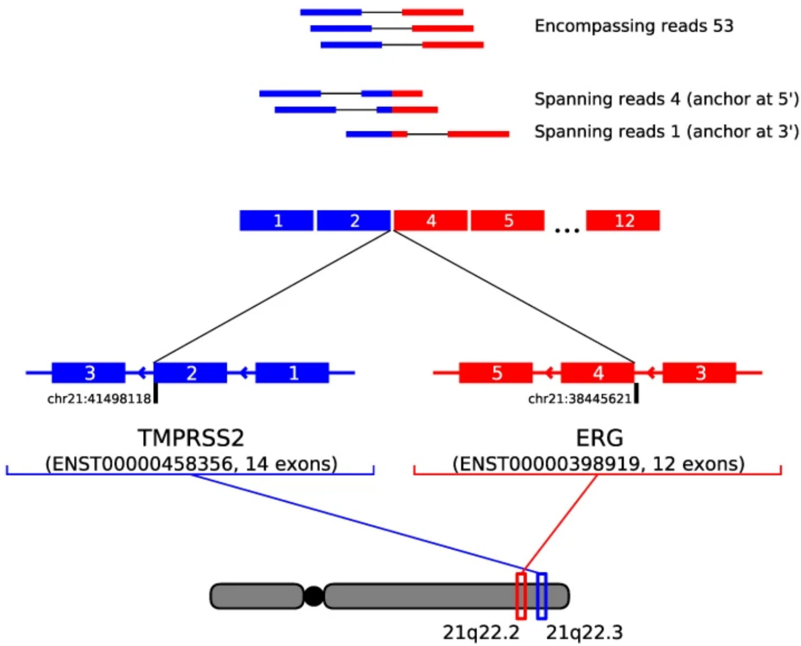{fig-align="center" width=80%}
:::
::: {.column width="50%"}
::: {.center}
Parkinson's disease
:::
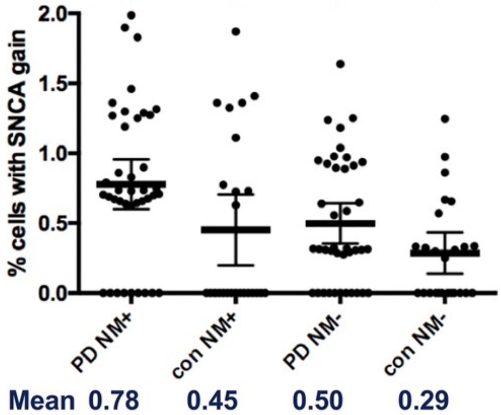{fig-align="center" width=80%}
:::
:::: 

:::{.center}
::: {.small}
Zhang, J. et al. 2017 | Mokretar, K. et al. 2018
:::
:::

::: {.notes}
- The motivation for my research is to understand how large mutations, called structural variants, cause human disease.
- For example, a gene fusion mutation, shown on the left, drives prostate cancer progression
- On the right, a duplication of the SCNA gene is enriched in dopamanergic neurons (NM+) of Parkinson's disease patients.
:::

## Structural variants

 

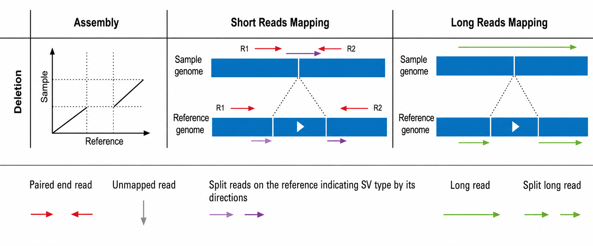{fig-align="center" width=70%}

:::{.center}
::: {.small}
Mahmoud, M. et al. 2019
:::
:::

::: {.notes}
- Structural variants are big mutations that deviate from what we expect to see in a human genome.
- To understand structural variants, we can look at a simple type: DELETION
- The left column graph depcits that the genome we have sampled has a discontinuity with respect to a human reference genome.
- We call this gap a "DELETION" since a segment of the genome expected to be in our sample is absent.
- The middle and right columns show how "sequencing reads", that is small fragments of our sample genome, align the reference in the context of a deletion in short and long-read technologies, respectively.
:::

## Population-scale SV studies

 

| Study | Topic | Samples |
| --- | --- | --- |
| 1000 Genomes Project | SV ancestry | 2,504 |
| gnomAD | Mutational constraint | 141,456 |
| **PCAWG** | **Tumor gene fusions** | **2,658** |

::: {.notes}
- Population-scale SV studies have already been conducted
- 1000 Genomes focused on SV geography and ancestry
- gnomAD (genome aggregation database) focused on finding genomic region with and without mutational constraints
- Finally, Pan-cancer analysis of Whole Genomes (PCAWG) studied cancer, including tumor-driving gene fusions
:::

## Gene fusions

 

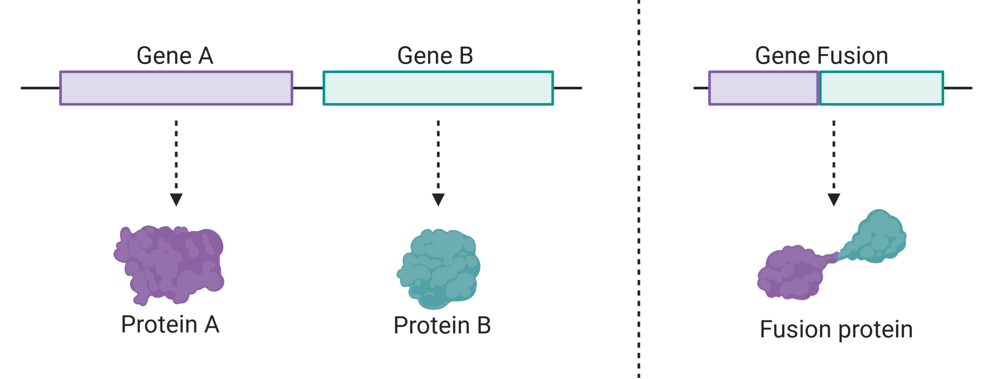{fig-align="center"}

::: {.notes}
- Gene fusions are mutations bridging two previously distal genes producing a novel protein product or causing dysregulation
:::

## PCAWG tumor fusions

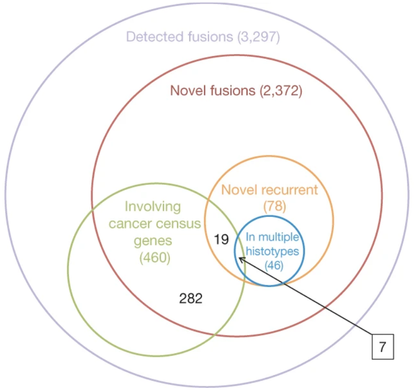{fig-align="center" width=70%}

::: {.notes}
- PCAWG analysis detected >3000 fusion, but only a small amount 78 were recurrent
- Recurrent fusions are really important because they occur in multiple samples
- Therefore, they are potential diagnostic markers and drug targets
:::

## Recurrent tumor-driving fusions

::: {.center}
::: {.small}
Dysregulation prostate cancer fusion
:::
:::

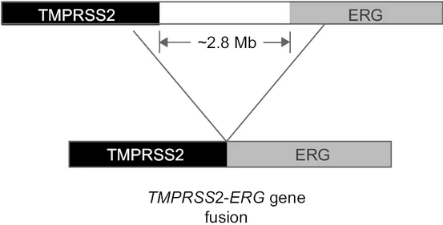{fig-align="center" width=45%}

{fig-align="center" width=45%}

::: {.notes}
- For example, the ERG-TMPRSS2 fusion recurs in ~50% of prostate cancer samples
- Therefore, it is a useful diagnostic marker
:::

<!-- ## Recurrent tumor fusions

::: {.center}
::: {.smaller}
"Of the 27 most recurrent gene fusions

(Extended Data Fig. 18a) ... ""
:::
:::

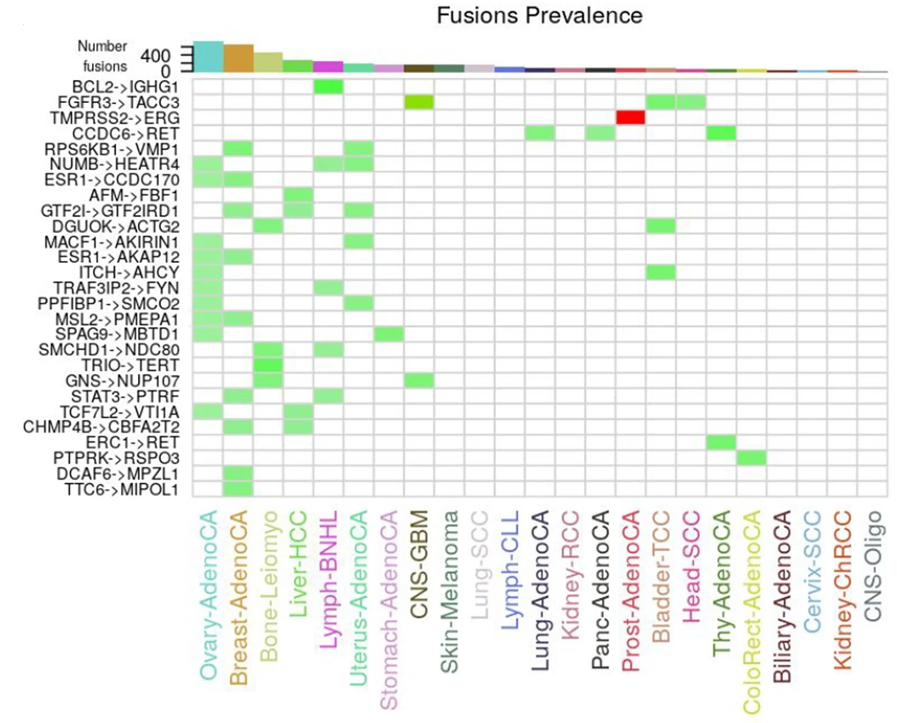{fig-align="center" width=70%} -->

## Differential recurrency

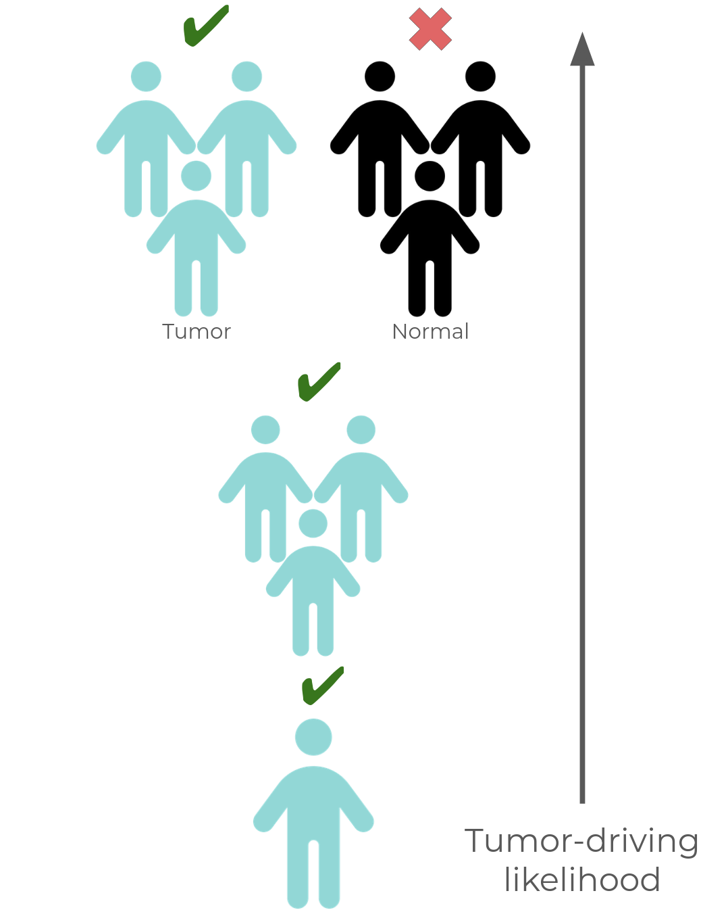{fig-align="center" width=70%}

::: {.notes}
- Intuitively, how we discvoery tumor-driving fusions is via differential recurrency
- The basic case is when we observe one tumor sample (in blue) with a fusion
- Our confidence increases when the fusion is observed in multiple samples
- Confidence is maximized when the fusion is also absent from normal, non-tumor samples (in black)
:::

## Multi-sample fusion calling gap

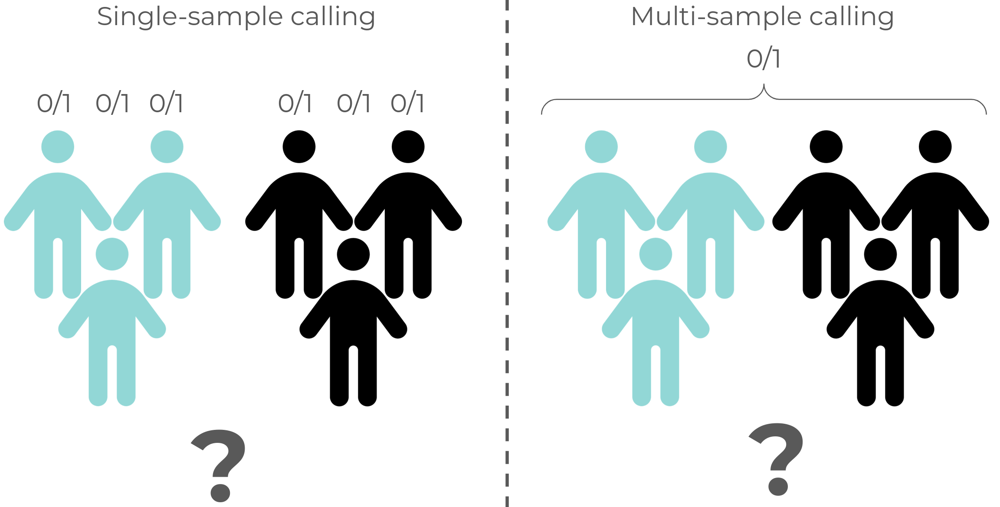

::: {.notes}
- A gap in population-scale analysis is the lacking leverage of multi-sample fusion calling
- An open question is how does multi-sample calling improve detection?
- We found a clear case where multi-sample calling is useful.
:::

## Low depth implies low sensitivity

::: {.center}
::: {.small}
K562 chronic myeloid leukemia STAR-Fusion calls
:::
:::

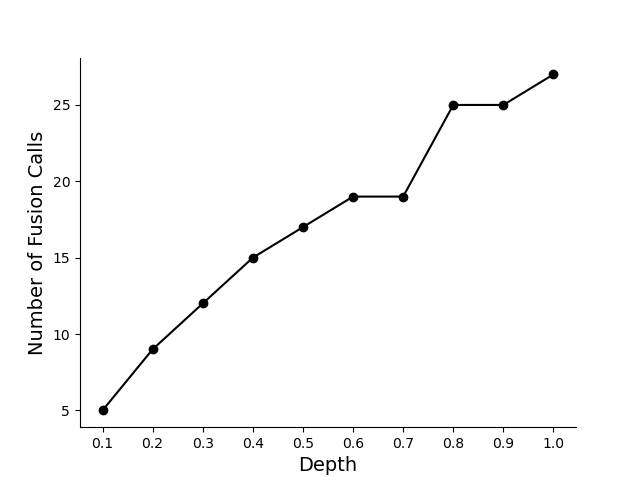{fig-align="center" width=70%}

::: {.notes}
- Here is the number of fusions called by the most popular tool, STAR-Fusion, on a leukemia cell line
- We see that the number of fusions detected linearly depends on sequencing depth
- While depth can increase if you have a lot of money, it may still be challenging to find certain fusions
- Due to the heterogenity of tumor samples
:::

## Tumor heterogeneity

::: {.center}
Low fusion signal
:::

 

:::: {.columns}
::: {.column width="10%"}
:::
::: {.column width="40%"}
::: {.center}
{fig-align="center" width=50%}
:::
:::
::: {.column width="40%"}
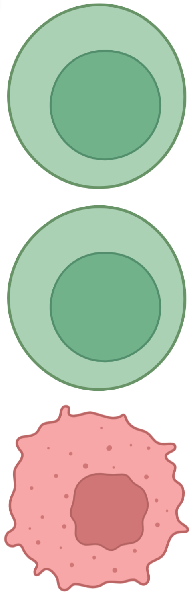{fig-align="center" width=30%}
:::
::: {.column width="10%"}
:::
::::

::: {.notes}
- Tumors are heterogenous
- It is possible only a small fraction of cells actually harbor the fusion
- Even high depth callers may overlook fraction fusion signal
- Yet, these fractional cells may be driving progression of the tumor microenvironment
:::

## Multiple samples increase sensitivity

::: {.center}
High aggregate fusion signal
:::

 

:::: {.columns}
::: {.column width="25%"}
::: {.center}
{fig-align="center" width=65%}
:::
:::
::: {.column width="25%"}
{fig-align="center" width=30%}
:::
::: {.column width="25%"}
::: {.center}
{fig-align="center" width=80%}
:::
:::
::: {.column width="25%"}
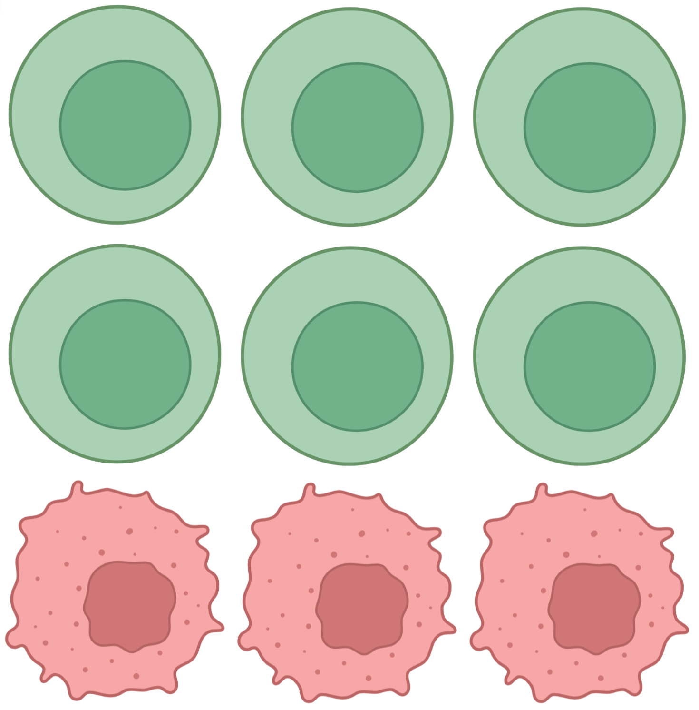{fig-align="center"}
:::
::::

::: {.notes}
- Aggregating across multiple samples, fractional fusion signal can be amplified
- Thus, easier to detect
:::

## Multiple samples increase specificity

::: {.center}
Ignore fusions with high normal signal
:::

 

:::: {.columns}
::: {.column width="25%"}
::: {.center}
{fig-align="center" width=65%}
:::
:::
::: {.column width="25%"}
{fig-align="center" width=30%}
:::
::: {.column width="25%"}
::: {.center}
{fig-align="center" width=80%}
:::
:::
::: {.column width="25%"}
{fig-align="center"}
:::
::::

:::{.notes}
- Adjacently, we can amplify non-tumor fusion signal by aggregating normal samples
- In fact, the depth of paired-normal samples in tumor-normal studies is often lower than the tumor sample, due to costs constraints
- In summary, multi-sample calling increases sensitivity to tumor fusions
- And improves filtering of non-tumor fusion signal
- However, this approach requires a lot of data
:::

## Tumor and control databases

::: {.center}
4,647 total human genome samples
:::

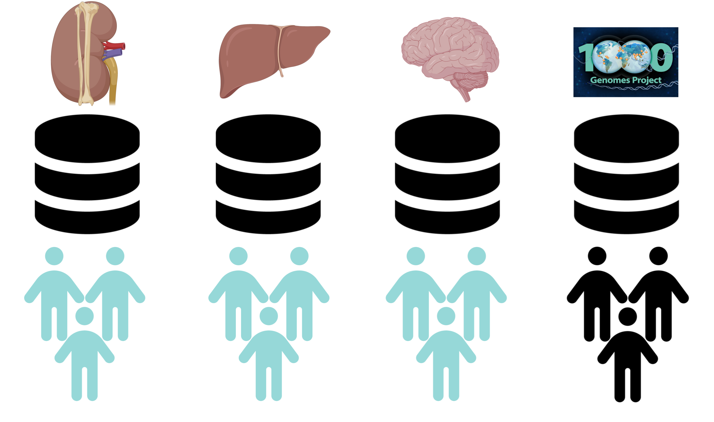{fig-align="center" width=70%}

::: {.notes}
- My analysis investigates over 4000 genomes samples
- Tumor samples are localized to their tissue of origin
- We supplement paired normal samples with an external control set 1000 Genomes for improved filtering
:::

## Fusion prioritization

<!-- - **Polymerization** score ranks fusions given multimodal data -->

 

:::: {.columns}
::: {.column width="33%"}

{fig-align="center" width=80%}
:::
::: {.column width="66%"}
{fig-align="center" width=100%}
:::
::::

::: {.notes}
- To find tumor-driving fusions among the over 100M possible gene pairs,
- We developed a scoring system to prioritize fusions given multi-sample and multi-omics data (DNA and RNA-seq)
- The key idea is to upweight evidence in tumor samples and downweight evidence in normal samples
:::

## Prostate ERG-TMPRSS2 evaluation

<!-- ::: {.small}
- Recurrent tumor fusion score is higher than random gene pairs
- PCAWG prostate fusion call (not recurrent) scores are right-skewed
::: -->

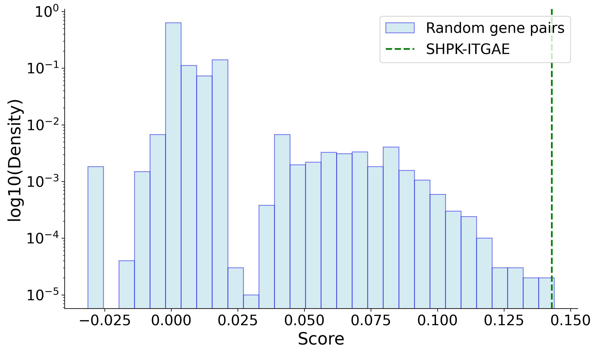{fig-align="center"}

::: {.notes}
- For evaluation, our score prioritized ERG-TMPRSS2 fusion over random gene pairs
- We generalized this evaluation to a larger set of fusions
:::

## Recurrent normal vs. tumor classification

:::: {.columns}

::: {.column width="60%"}
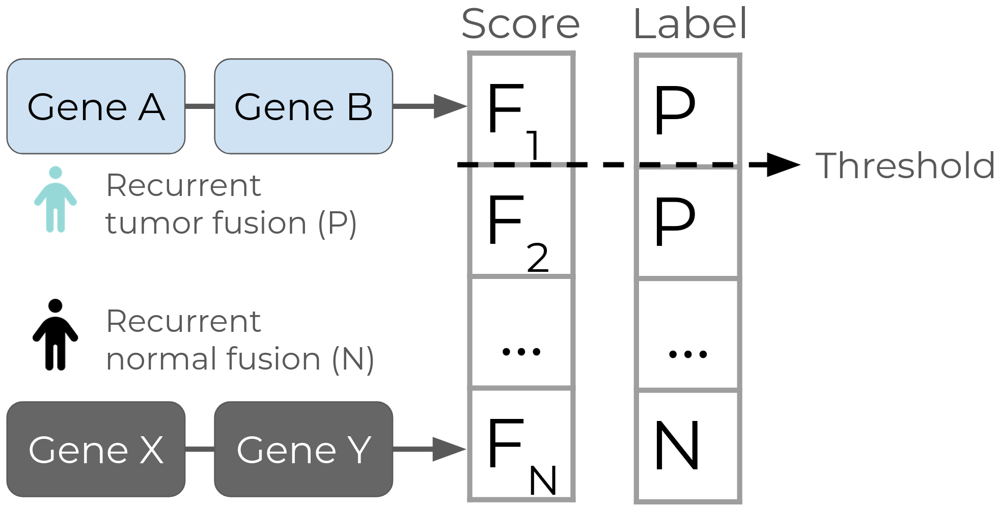
:::
::: {.column width="40%"}
{fig-align="center"}
:::
::::

::: {.notes}
- Using fusions known to recur in normal or tumor samples,
- We evaluated our score's separation of normal versus tumor fusions
- Since our data is from multiple tissues, technologies, and specimen types,
- We tested different methods to aggregate scores from each modality,
- All performed better than random, but there are a few errors to address
:::

## Recurrent tissue classification

:::: {.columns}
::: {.column width="40%"}
 
{fig-align="center"}
:::
::: {.column width="60%"}
:::{.center}
{fig-align="center" width=80%}
:::
:::
::::

::: {.notes}
- For further evaluation, we evaluated the ability to prioritize which tissue a tumor fusion is present in
- For each recurrent fusion in PCAWG, a positive example was scored using only from the reported tissue
- A paired negative example was scored using all samples not from the reported tissue
- For example, a positive ERG-TMPRSS2 fusion score was computed using prostate samples only
- And, a paired negative example was scored using all non-prostate samples
:::

## Tissue specificity score evaluation

:::: {.columns}
::: {.column width="60%"}
 
{fig-align="center"}
:::
::: {.column width="40%"}
 
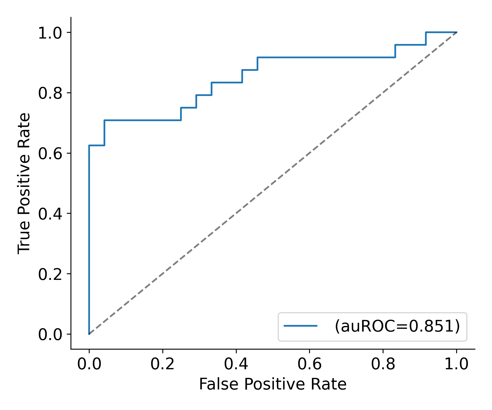{fig-align="center"}
:::
::::

## Novel kidney fusion discovery

{fig-align="center" width=40%}

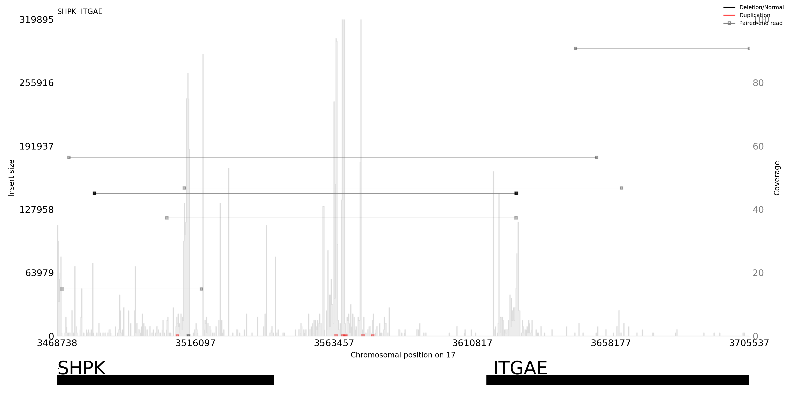{fig-align="center" width=50%}

<!-- :::: {.columns}
::: {.column width="50%"}
{width=80% fig-align="center"}
:::
::: {.column width="50%"}
{fig-align="center"}
:::
:::: -->

## Discovery potential

{fig-align="center" width=80%}

## Filtering with control cohort

::: {.center}
- 59,117 benchmark cancer cell line fusions
:::

:::: {.columns}
::: {.column width="50%"}
{fig-align="center" width=100%}
:::
::: {.column width="50%"}
{fig-align="center" width=100%}
:::
::::

<!-- :::: {.columns}
::: {.column width="33%"}
{fig-align="center" width=80%}
:::
::: {.column width="33%"}
:::
::: {.column width="34%"}
{fig-align="center" width=80%}
:::
:::: -->

## Appendix

## Data

::: {.small}
- Tumor and control (WGS & RNA-seq): 2,143 Pan-cancer Analysis of Whole Genomes (PCAWG) samples
- Control (WGS): 2,504 samples from 1000G project
- Total 4,647 human genome samples
:::

:::: {.columns}
::: {.column width="50%"}
{fig-align="center" width=80%}
:::
::: {.column width="50%"}
{fig-align="center" width=70%}
:::
::::

:::aside
Variability in tissue, sequencing technology, and disease state across samples
:::

## Read-level resolution

- Read-level fusion evidence is stored for each sample

:::: {.columns}
::: {.column width="33%"}
{fig-align="center" width=55%}
{fig-align="center" width=55%}
:::
::: {.column width="66%"}

 

{fig-align="center" width=100%}
:::
::::

## Fundamental units of fusion evidence

$$
\text{score} = {\color{skyblue}{\text{#reads}}} + {\color{skyblue}{\text{#samples}}} - \text{#reads} - \text{#samples}
$$

## Normalization

::: {.small}
- Normalization accounts for population size and sequencing parameters (coverage)
:::

:::: {.columns}
::: {.column width="50%"}
{fig-align="center" width=60%}
:::
::: {.column width="50%"}
{fig-align="center" width=80%}
:::
::::

:::: {.columns}
::: {.column width="40%"}
::: {.very-small}
$$
\text{score}_{\text{sample}} \in [0,1] = \frac{\text{#samples}}{\text{Population size}} 
$$
:::
:::

::: {.column width="40%"}
::: {.very-small}
$$
\text{score}_{\text{reads}} \in [0,1] =
\begin{cases}
  \frac{\mathbb{E}[\text{max reads]} - |\text{#reads} - \mathbb{E}[\text{max reads}]|}{\mathbb{E}[\text{max reads}]} & \text{if #reads} \leq 2\cdot \mathbb{E}[\text{max reads}] \\[6pt]
  0 & \text{else}
\end{cases} 
$$
:::
:::

::: {.column width="30%"}

:::
::::

## Next steps

- Find high confidence novel candidates
- Write

<!-- ## Further gaps

::: {.center}

::: {.small}
- RNA-seq focused, **not DNA-seq**
- Assume short, paired-end read sequencing data, not **long read**
- [Single-sample, **not multi-sample**]{.underline}
:::

:::

:::: {.columns}
::: {.column width="33%"}
{fig-align="center" width=80%}
:::
::: {.column width="33%"}

  

{fig-align="center"}
:::
::: {.column width="34%"}
{fig-align="center" width=65%}
:::
:::: -->

<!-- ## Leveraging corroborating evidence

{fig-align="center" width=40%} -->

<!-- ## Addressing gaps

{fig-align="center" width=70%} -->